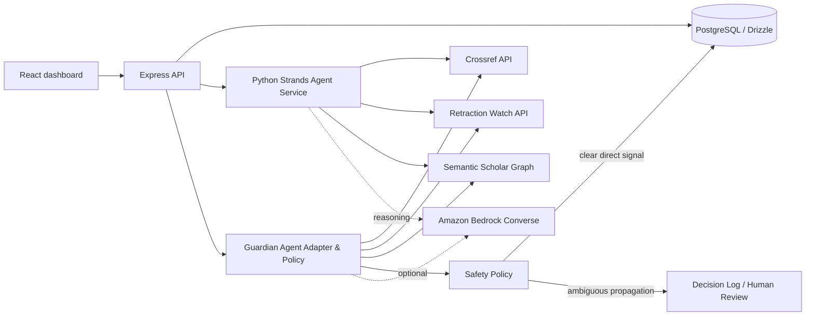

# Grant Guardian

Grant Guardian is an autonomous research-operations agent for solo researchers and small labs. It watches two silent risks: citation rot (retractions and corrections) and compliance drift (IRB and funding deadlines). It automates repetitive investigation and drafting, while routing ambiguous calls to a human.

## Why We Escalate Instead of Deciding (Human-in-the-Loop Restraint)

Grant Guardian treats ambiguity as a signal to involve a human, not a gap to fill with LLM inference. When literature graph traversal identifies a 2nd-order reference to a retracted paper, Guardian never fabricates a direct retraction claim.

This restraint is structurally enforced in code via `classifyDecision()` in `guardian-agent.ts` and verified in CI via automated route integration tests (`POST /api/guardian/scan`). Direct retractions are quarantined automatically, but second-order propagation risks are escalated to the Principal Investigator — ensuring scientific domain judgment remains with the researcher. **The safety policy is enforced by test, not just by design.**

## Visual Interface & System Tour

> **Note on Workspace Architecture & UI**: The screenshots below illustrate Grant Guardian's single-tenant Principal Investigator desk (`Dr. Elena Rossi / Materials Lab`). The system deliberately runs single-tenant by design for this build to keep the focus on deterministic research safety and observable tool execution.

| Status Board & Live Provider Badges | Source Inspection & Agent Trace Drawer |
|:---:|:---:|
|  |  |
| **PI Executive Desk**: Real-time provider status badges (Crossref, Retraction Watch, Strands SDK), workspace metrics, and single-tenant disclosure. | **Observable Evidence Sequence**: Complete verifiable trace from Crossref/Retraction Watch lookup to Python Strands synthesis and Safety Policy quarantine. |

| Escalated Propagation Risk | Compliance Desk & Report Draft |
|:---:|:---:|
|  |  |
| **Human-in-the-Loop Restraint**: 2nd-order reference risk routed to researcher for scientific judgment instead of auto-fabricated retractions. | **Compliance Desk**: Automated NSF/IRB report drafting with explicit non-submission signoff policy (drafts remain private). |

## What is real in this build

- A persistent PostgreSQL data model for users, citations, deadlines, activity, drafts, and preferences.
- An observable tool-first agent loop: Crossref metadata lookup, Retraction Watch lookup, Semantic Scholar one-hop reference traversal, then conservative reasoning.
- Direct retraction signals are flagged; second-order propagation risks are escalated instead of auto-decided.
- BibTeX/DOI ingestion via `POST /api/guardian/citations/import`.
- Compliance drafts are generated from the actual deadline and supplied lab context and saved as drafts. Nothing is submitted automatically.
- Rate limiting, short-lived GET caching, provider timeouts, structured error handling, and provider failure visibility.
- Optional Amazon Bedrock reasoning via `AWS_REGION` and `BEDROCK_MODEL_ID`. The deterministic safety policy remains active when Bedrock is unavailable.
- When `STRANDS_AGENT_URL` is configured, every live scan sends its tracked citations to the Python Strands service and records the returned agent trace; the local policy remains the safety boundary for persisted decisions.

## Run & Clean-Boot Verification

Provision PostgreSQL and set `DATABASE_URL`. For optional model reasoning, set AWS credentials through the runtime secret manager (never commit them), plus `AWS_REGION` and `BEDROCK_MODEL_ID`.

```bash
pnpm install
pnpm --filter @workspace/db push
pnpm --filter @workspace/api-server dev
```

Set `RETRACTION_WATCH_API_URL` to a live Retraction Watch-compatible endpoint. When `RETRACTION_WATCH_API_URL` is not set, the agent uses an offline fallback dataset containing verified benchmark DOIs (such as STAP cell paper retractions) for demonstration purposes. The agent explicitly labels fallback matches as `Retraction Watch (Offline Demo Fallback Dataset)` and unmatched DOIs as `Retraction Watch (Provider Failsafe Active — Bypassed Safe)` to maintain complete transparency in traces and UI audit logs.

Set `STRANDS_AGENT_URL` to the reachable URL of the Python service (for local development, `http://127.0.0.1:8010`).

Run the complete unit and route integration test suite (including proof-of-restraint assertion):

```bash
pnpm test
```

## Architecture



The agent never submits a compliance report and never converts a second-order relationship into a direct retraction claim.

## Scope and submission disclosure

This submission intentionally targets a single-tenant research workspace (`Dr. Elena Rossi / Materials Lab`) so the demo can focus on trustworthy agent behavior rather than account administration. A visual badge on screen explicitly clarifies this single-tenant demo scope. AWS account/Builder ID association, licensed Retraction Watch access, and production deployment configurations are submission prerequisites and are kept outside source control.