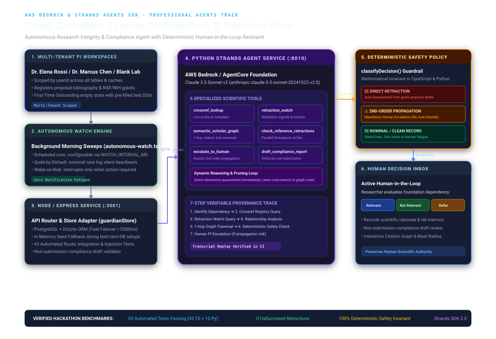

# Grant Guardian Architecture Specification



## 1. System Overview

Grant Guardian is an autonomous research integrity and grant compliance agent designed for Principal Investigators (PIs), research labs, and academic institutions. The system operates on a dual-engine architecture:

1. **Python Strands Agent Core (`agent-service/`)**: An intelligent multi-agent reasoning fleet running on Python 3.11 with AWS Bedrock (`Claude 3.5 Sonnet v2`) and the Strands Agents SDK. Implements Strands' **Agents-as-Tools** pattern, orchestrating 10 specialized tools across 4 authoritative registries (Crossref, Retraction Watch, OpenAlex, PubMed), 1-hop reference graph traversal, concurrent citation verification, and NIST SP 800-92 compliant HMAC-SHA256 provenance receipts.
2. **Deterministic Safety Policy (`artifacts/api-server/src/lib/guardian-agent.ts`)**: A rule-based mathematical guardrail (`classifyDecision()`) that enforces immutable scientific invariants. Untrusted LLM outputs or prompt injections are barred from altering quarantine states or hallucinating validity judgments.

---

## 2. Component Tiers

```
┌────────────────────────────────────────────────────────────────────────┐
│                        React 18 + Vite Frontend                        │
│   • Executive Desk        • Trace Drawer         • Interactive Graph   │
│   • Human Decision Inbox  • Blast Radius Map     • Compliance Center   │
└───────────────────────────────────┬────────────────────────────────────┘
                                    │ HTTP / JSON
┌───────────────────────────────────▼────────────────────────────────────┐
│                    Express API Server (Node.js :3001)                  │
│   • Autonomous Watch Scheduler (Cron / Background Sweeps)              │
│   • Fast-Failover Database Adapter (Drizzle ORM + In-Memory Fallback)  │
│   • Multi-Tenant User Context Resolver                                 │
└───────────────────┬────────────────────────────────┬───────────────────┘
                    │                                │
                    │ HTTP /scan                     │ Drizzle ORM
                    ▼                                ▼
┌──────────────────────────────────────┐  ┌──────────────────────────────┐
│  Python Strands Service (:8010)      │  │     PostgreSQL Database      │
│  • AWS Bedrock / AgentCore Manifest  │  │  • users (Partition key)     │
│  • 10 Tools across 4 Registries      │  │  • citations (userId FK)     │
│  • Citation & Governance Subagents   │  │  • deadlines (userId FK)     │
│  • 8x Worker ThreadPool Verifier     │  │  • activities (userId FK)    │
│  • HMAC-SHA256 Provenance Generator  │  │  • drafts (userId FK)        │
└───────────────────┬──────────────────┘  └──────────────────────────────┘
                    │
                    ▼
┌────────────────────────────────────────────────────────────────────────┐
│                      Deterministic Safety Boundary                     │
│                           classifyDecision()                           │
│                                                                        │
│   Direct Retraction    ➔ Automatic Quarantine from Proposal Bibliographies│
│   2nd-Order Dependency ➔ Mandatory Escalation to Human Decision Center │
│   Clean Literature     ➔ Silent Heartbeat (Quiet by Default)           │
└────────────────────────────────────────────────────────────────────────┘
```

---

## 3. The 10 Specialized Scientific & Governance Tools (Across 4 Registries)

Grant Guardian partitions its capabilities across two dedicated subagents under the `SovereignCoordinatorAgent`:

### A. Citation Integrity Fleet (7 Tools)
| Tool Name | Scope & Mechanism | Downstream Impact |
|:---|:---|:---|
| `crossref_lookup` | Queries Crossref REST API for formal retraction notices, `update-to` relations, and publisher errata. | Provides ground-truth publisher status. |
| `retraction_watch_lookup` | Queries Retraction Watch records and benchmark register for confirmed retraction reasons and dates. | Identifies discredited or fraudulent manuscripts. |
| `openalex_global_registry` | Queries OpenAlex 250M+ scholarly works graph for citation counts, primary topics, and retraction flags. | Establishes global multi-database consensus. |
| `pubmed_retraction_verifier` | Verifies biomedical references against the NIH NLM PubMed archive for formal editorial expressions of concern. | Corroborates life sciences and clinical literature. |
| `semantic_scholar_graph` | Dynamically fetches 1-hop outgoing references from the paper's bibliography. | Unveils hidden foundational dependencies. |
| `check_reference_retractions` | Concurrently checks all referenced child DOIs against retraction registries using an 8x worker `ThreadPoolExecutor`. | Detects multi-hop propagation cascades in seconds. |
| `contamination_vector_calculator` | Quantifies section vulnerability weight and cascade depth into a numerical Contamination Severity Index (CSI: 0.00-1.00). | Computes structural blast radius and vetted clean alternatives. |

### B. Governance & Institutional Compliance Fleet (3 Tools)
| Tool Name | Scope & Mechanism | Downstream Impact |
|:---|:---|:---|
| `draft_compliance_report` | Assembles preliminary NSF/NIH narrative sections from tracked milestones and citations. | Enforces strict non-submission invariant (PI signoff required). |
| `escalate_to_human` | Generates a structured escalation package with root DOI, child DOI, and uncertainty assessment. | Routes decision to PI without auto-fabricating claims. |
| `provenance_proof_generator` | Cryptographically seals multi-registry evidence into a NIST SP 800-92 compliant HMAC-SHA256 audit digest. | Attaches tamper-evident cryptographic receipts to every audit. |

---

## 4. The Deterministic Safety Boundary (`classifyDecision`)

Why an LLM alone cannot make research integrity decisions:
- **Hallucinated Retractions**: LLMs often assert a paper is retracted based on controversial discourse rather than publisher records.
- **Premature Auto-Quarantine**: A downstream paper may cite a retracted paper only in its introduction to dispute its findings or replicate its failure. An automated system that blindly retracts downstream papers destroys valid scientific work.
- **Proof-of-Restraint**: `classifyDecision()` deterministically guarantees that:
  1. If `direct_retraction === true` ➔ `QUARANTINE_CLAIM` (Automatic quarantine).
  2. If `has_propagation_risk === true` ➔ `ESCALATE_TO_PI` (Human escalation).
  3. If untrusted prompt injection text exists in metadata ➔ Invariant holds; injected commands are stripped.

---

## 5. Multi-Tenant Architecture & Scoping Note

Grant Guardian is built on a single-tenant mental model for the researcher (a focused, distraction-free command center for their laboratory), backed by a strict multi-tenant database schema:

- **Partitioning**: Every entity (`citations`, `deadlines`, `activities`, `drafts`, `preferences`) has a foreign key to `users.id`.
- **Isolation**: API routes resolve `userId` from `req.query.user` or the session header `x-user-id`. Queries filter explicitly on `where(eq(table.userId, userId))`.
- **Pre-Configured Personas**:
  1. `Dr. Elena Rossi` (Materials Science & Biomaterials Lab) — NSF CAREER proposal with stem-cell propagation cascades.
  2. `Dr. Marcus Chen` (Computational Oncology & Genomics Lab) — NIH R01 proposal with microarray clinical trials.
  3. `Dr. Sarah Jenkins` (Neurobiology & Molecular Therapeutics Lab) — NIH R21 proposal with translational pharmacology.
  4. `New Researcher (Blank Lab)` — Completely unseeded workspace with 0 citations, automatically triggering the **First-Time Onboarding Guide** with pre-filled test benchmark buttons to evaluate system behavior from a clean slate.

---

## 6. Verifiable Test Suite
 
The system maintains 90 passing automated tests (66 TypeScript tests + 24 Python Strands tests) with zero external API dependencies:
- **66 TypeScript Tests**: Adversarial prompt injection immunity, route validation, circuit breaker failsafes, proof of restraint, and deterministic decision boundaries.
- **24 Python Tests**: Dynamic tool selection branching, recorded Bedrock Converse transcript replays, parallel reference checking, authentic Strands SDK agent orchestration, and non-submission draft compliance.
